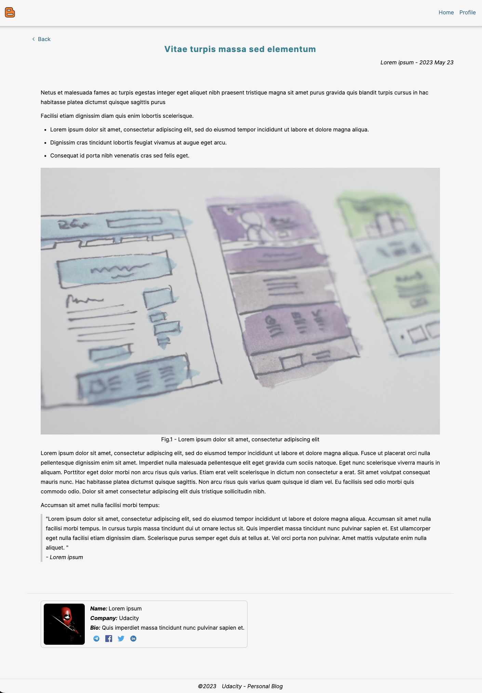

# Udablog

## Introduction

This project requires you to utilize your HTML and CSS skills to build out a personal blog website, including custom images, layout, and styling. Along with webpage design considerations, you'll work to appropriately structure your files, as well as use proper CSS and HTML formatting & style.

## How to run

Opening the index.html file in the browser.

## Project screenshot

## Resource

Image: https://unsplash.com/s/photos/flash

Icon: https://www.svgrepo.com/

Font: https://fonts.google.com

Content: https://loremipsum.io